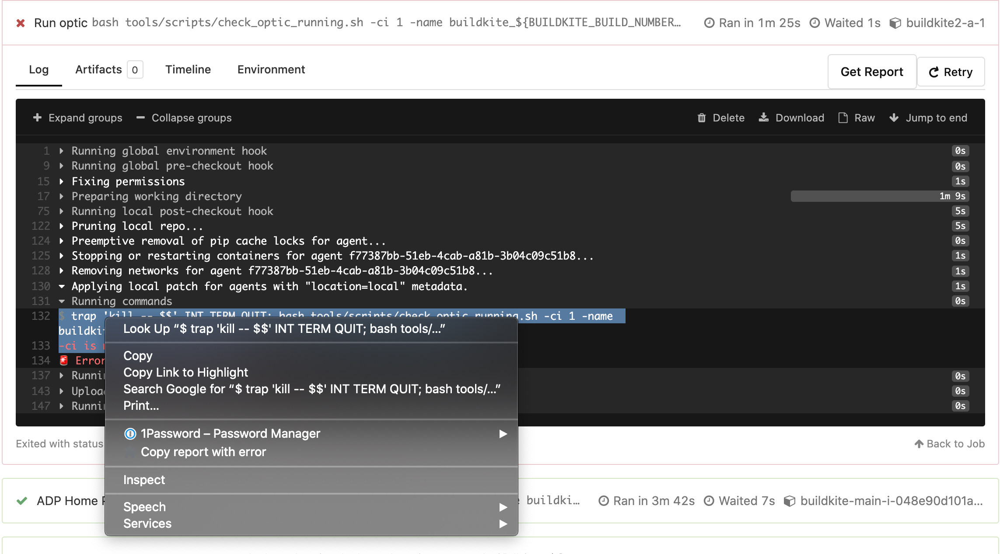

# buildkite retry

Here’s a Chrome extension with some useful Buildkite workflow shortcuts, currently including a button to retry all failed tests on your current buildkite page and a way to quickly report test-infra issues.
DISCLAIMER please retry responsibly and only use if you know that your tests are flaking due to reasons unrelated to your changes :slightly_smiling_face:

## Installation

1. Navigate to, chrome://extensions/

2. Enable "Developer mode"

3. Click "Load unpacked"

4. Select this repo and click "Open"

## Usage

### Retry failed builds
1. Navigate to webpage of the build (https://buildkite.com/$BUILDKITE_ORGANIZATION_SLUG/$BUILDKITE_PIPELINE_SLUG/builds/$BUILDKITE_BUILD_NUMBER)

2. If enabled correctly, the extension will add a "Retry Failed" button to the page.

### Copy issues to eng-test-infra
1. Select the text of the failing test that you'd like to include in your error report.

2. Right-click and then select "Copy report with error..." from the dropdown.

