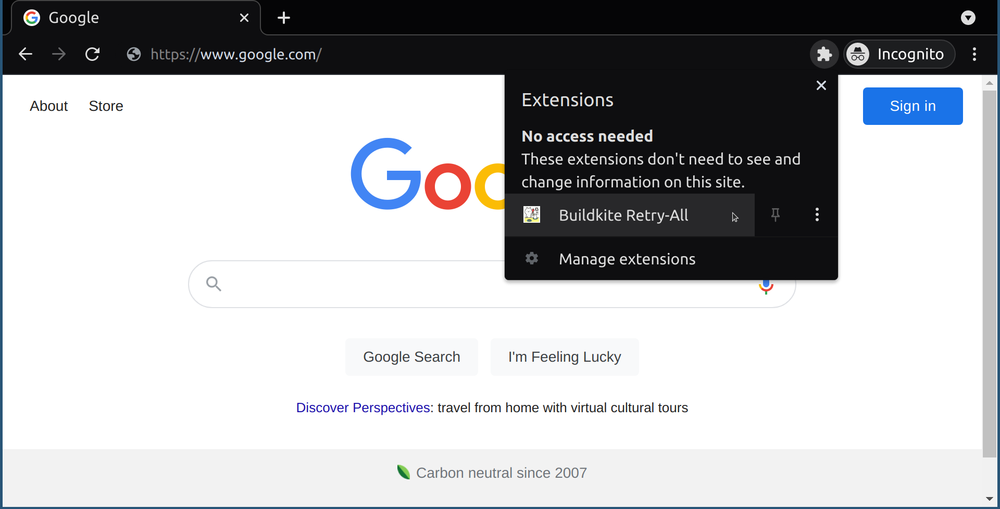

# buildkite retry

Tired of retrying all of your buildkite tests individually?
Here’s a small (~30 lines of code) Chrome extension that will display a button to retry all failed tests on your current buildkite page. DISCLAIMER please use responsibly and only use if you know that your tests are flaking due to reasons unrelated to your changes :slightly_smiling_face:

## Installation

1. Navigate to, chrome://extensions/

2. Enable "Developer mode"

3. Click "Load unpacked"

4. Select this repo and click "Open"

## Usage

1. Navigate to webpage of the build (https://buildkite.com/$BUILDKITE_ORGANIZATION_SLUG/$BUILDKITE_PIPELINE_SLUG/builds/$BUILDKITE_BUILD_NUMBER)

2. Click the extensions drop-down

3. From the extensions menu, click the "Buildkite Retry-All" item

4. In the dialog that appears, click the "Retry failed Buildkite tests" button

